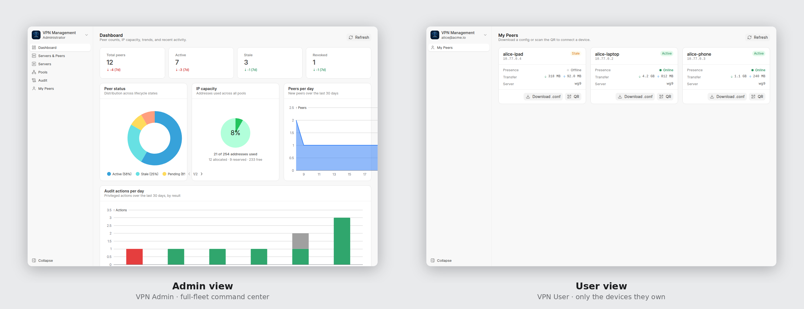
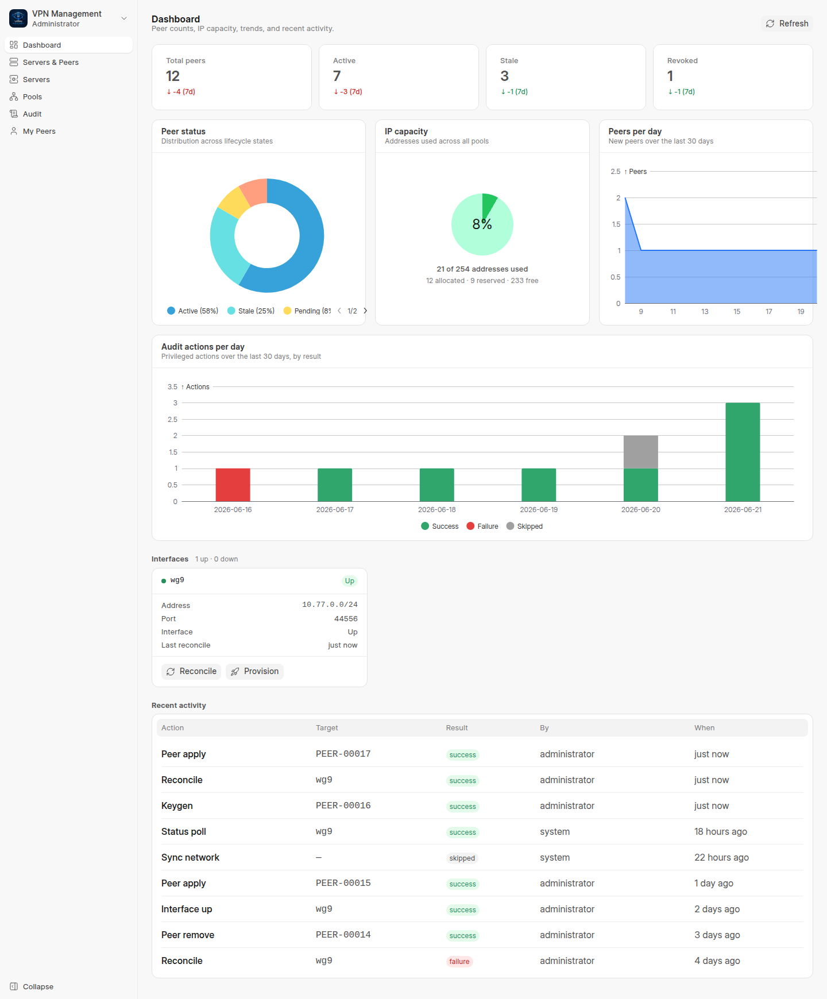
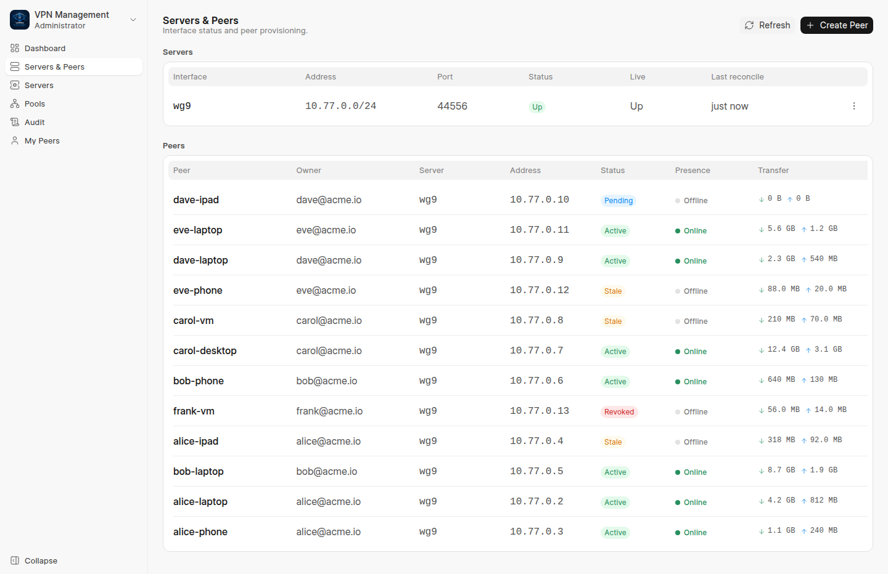
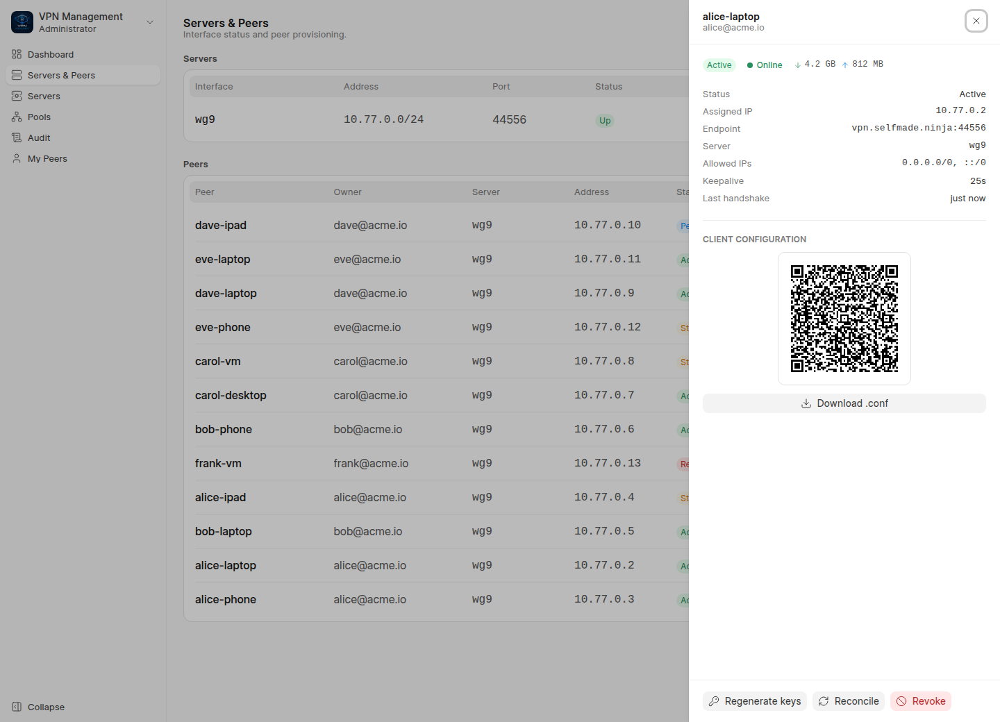
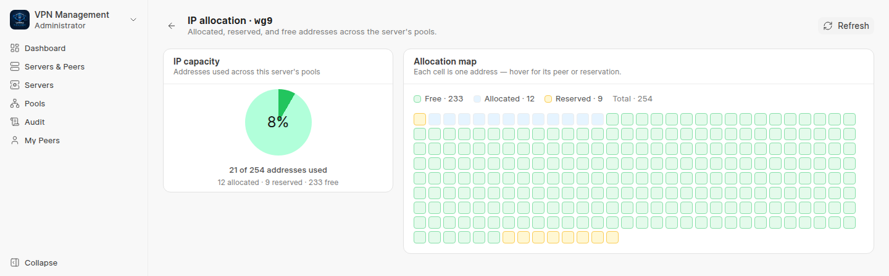
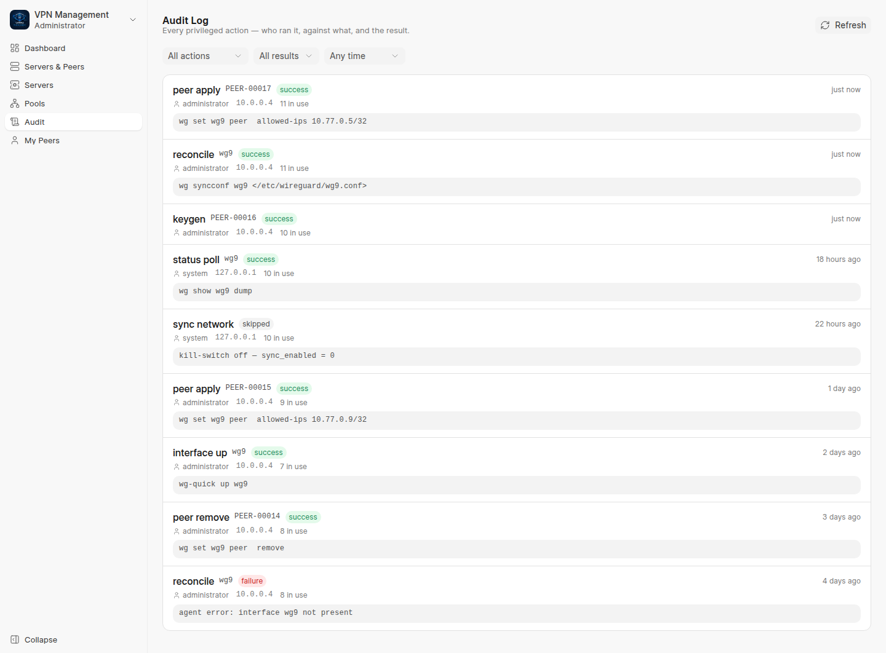
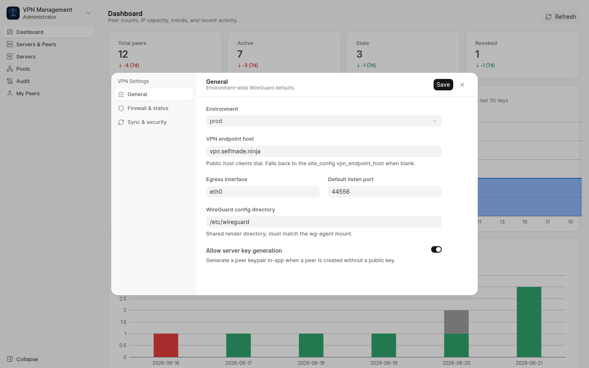
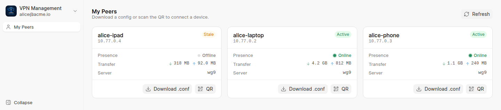
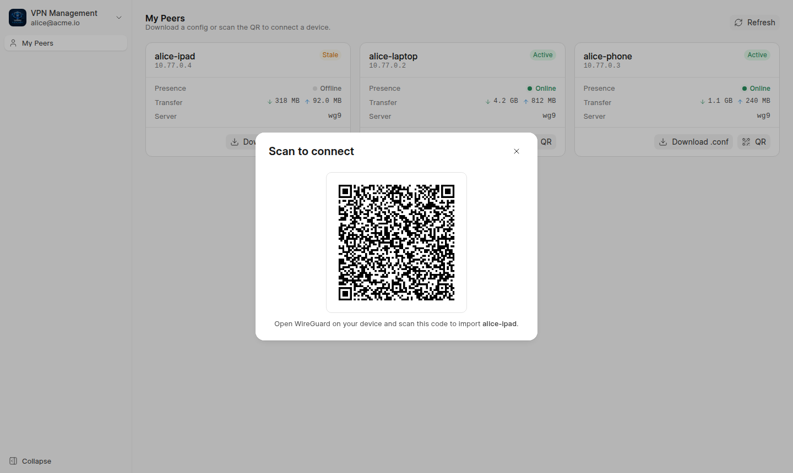

<div align="center">

# VPN Management

**A clean-room WireGuard control plane, built as a reusable Frappe app.**

Manage a fleet of WireGuard peers from a purpose-built **Frappe UI command center**, hand users a
self-service portal for their own config + QR, and drive everything from a token-authenticated REST API —
while the kernel-touching half stays locked behind a single, minimal, validated socket.


</div>

---

## Demo

https://github.com/Venkateshvenki404224/vpn_management/raw/version-16/docs/images/demo.mp4

> ▶️ A short walkthrough of the admin command center and the self-service portal. If the player
> doesn't load in your viewer, [watch `docs/images/demo.mp4`](docs/images/demo.mp4) directly.

---

## Why this exists

The original WireGuard stack it replaces carried real scars: committed secrets, broad `www-data` sudo
grants, and a production incident where an exposed `/syncnetwork` call **wiped every IP allocation** via a
`deleteMany() + insertMany()` re-sync.

`vpn_management` recreates that capability **faithfully but cleanly**, with the footguns designed out. One
load-bearing principle drives the whole design:

> **The Frappe database is the source of truth; the live kernel interface is a reconciled artifact.**

Peer and interface state live in DocTypes. A `render → wg syncconf` reconcile converges the running
interface toward the database — never the other way around. This structurally eliminates the entire class
of "a fresh `wg0.conf` wiped the allocations" incidents: the destructive bulk-delete path simply does not
exist in the code.

---

## Highlights

- 🗄️ **DB-as-source-of-truth reconcile** — peers/servers are DocTypes; a diff-only `wg syncconf` converges
  the live interface and preserves existing handshakes. A `config_hash` short-circuits no-op reconciles.
- 🔐 **Single privileged funnel** — every Frappe container stays unprivileged. The only component that
  touches the kernel is one `wg-agent` sidecar exposing a **closed four-verb set** (`up`, `down`,
  `syncconf`, `show`) over a uid-scoped unix socket. No host sudo, no `docker.sock`, no shell-out.
- 🧮 **Atomic, never-wiped IP allocation** — addresses are claimed with a `SELECT … FOR UPDATE` row lock
  from a materialized pool. Allocation is idempotent UPSERT-only; rows are never bulk-deleted.
- 👥 **Four roles, five-layer isolation** — VPN Admin / User / API / Sync. A portal user can reach only the
  peers they own, enforced independently at five layers.
- 📱 **Self-service portal** — users log in at `/vpn`, download their own `.conf`, or scan a QR straight
  into the WireGuard mobile app. Private keys never appear in any list, API response, or audit row.
- 🔌 **Token REST API** — fully type-hinted, explicit `methods=`, no `allow_guest` anywhere.
- 🧱 **Hardened `sync_network`** — the incident-causing endpoint, rebuilt behind five independent gates and
  structurally incapable of deleting an allocation.
- 📝 **Append-only audit log** — every privileged action is recorded with actor, source IP, redacted argv,
  result, and the in-use allocation count at run time.

---

## Architecture

```
   ┌─────────────── Frappe containers (bridge net, UNPRIVILEGED) ─────────────┐
   │  SPA /vpn (VPN Admin console · VPN User portal) · REST /api (API token)   │
   │            DocTypes ── controllers ── api.py ── tasks.py                  │
   │                         │ frappe.enqueue(queue="long")                    │
   │             queue-long worker ── privileged.py                            │
   └─────────────────────────────┼────────────────────────────────────────────┘
                                  │ JSON over a unix socket
                  (shared volume  wg-agent-sock:/run/wg-agent/agent.sock)
                                  ▼
   ┌────────── wg-agent sidecar (network_mode: host, NET_ADMIN, SYS_MODULE) ───┐
   │ agentd: closed verb set {up, down, syncconf, show} — validates every arg  │
   │ owns /etc/wireguard (vpnstorage volume) + runs wg / wg-quick / iptables   │
   └─────────────────────────────┼────────────────────────────────────────────┘
                                  ▼
      wg0 (UDP 44556) ── iptables NAT / FORWARD / multiport REDIRECT ── host eth0
```

**The socket spine is the security boundary.** The unprivileged `queue-long` worker calls
[`privileged.py`](vpn_management/privileged.py), which connects to `/run/wg-agent/agent.sock` and sends a
JSON `{verb, args}`. The root-run `agentd` inside the sidecar **re-validates every argument** (interface
must match `^wg[0-9]+$`; the rendered conf must be mode-`600` under the shared render dir; ports `1–65535`;
PostUp/PostDown directives must pass a semantic `iptables`-only allowlist) before it ever touches the
kernel. Keypairs are generated in-app via the `cryptography` library's X25519, so the agent's verb set stays minimal — there
is no `keygen`, `cat`, `git`, or arbitrary-exec surface to abuse.

---

## Security model — footguns designed out

| Original footgun | How this app removes it |
|---|---|
| `deleteMany() + insertMany()` sync wiped all allocations | Reconcile is **UPSERT-only** (`INSERT IGNORE`). No code path deletes allocations in bulk. |
| Broad `www-data` sudo (`wg`, `wg-quick`, `cat`, `nmap`, `git`) | Privilege shrinks to **four validated verbs** on a uid-scoped socket. No host sudo at all. |
| Secrets committed to git | Keys live in encrypted `Password` fields; tokens/endpoint live in `site_config` (never in git, never web-served). |
| Exposed `/syncnetwork` token leak → remote wipe | `sync_network` sits behind **5 gates**: kill-switch → loopback-only → constant-time token compare → role check → UPSERT-only. |
| API + `wg` fused in one host-net container | API lives in **unprivileged** Frappe containers; only the lone sidecar holds `NET_ADMIN` + `SYS_MODULE`. |
| Private keys leaked through API responses | Responses are built from an explicit **safe-field allowlist**; `Password` fields are never serialized. |

**Five-layer cross-user isolation** keeps a portal user inside their own peers:
1. portal query filtered by `owner_user`,
2. `if_owner` read permission on the DocType,
3. `permission_query_conditions` hook,
4. `has_website_permission` hook,
5. a per-request ownership recheck in the download endpoints that never trusts the perm system.

---

## Data model (DocTypes)

| DocType | Kind | Purpose |
|---|---|---|
| **VPN Settings** | Single | Global config + ops toggles (environment, ports, redirect, kill-switches). |
| **WireGuard Server** | Document | One per interface (default `wg0`); server keypair, listen port, CIDR, firewall rules, live status. |
| **WireGuard Firewall Rule** | Child table | The NAT/FORWARD/MASQUERADE/REDIRECT rules as data, seeded on server insert. |
| **Network Pool** | Document | A CIDR materialized into one allocatable row per candidate IP. |
| **Network Reserved Range** | Child table | Sub-ranges within a pool that are never allocatable. |
| **IP Allocation** | Document | One row per candidate IP; the idempotent upsert key. **Never bulk-deleted.** |
| **VPN Peer** | Document | A client: keys, assigned IP, owner, status, live handshake/transfer counters. |
| **VPN Audit Log** | Document | Append-only, server-written record of every privileged action (90-day retention). |

---

## Interfaces

Everything human-facing is one **Frappe UI single-page app served at `/vpn`** that adapts to the caller's
role. The same sign-in lands a **VPN Admin** on a full-fleet command center and a **VPN User** on a
self-service list of only the devices they own — the router guard and the five-layer isolation keep each
role inside its own surface.

<p align="center">
  
</p>

*Left: the admin command center at `/vpn/admin` — full sidebar, fleet-wide charts. Right: a user's portal at
`/vpn/my-peers` — the sidebar collapses to a single entry and every request is owner-scoped. (Sample data
shown for illustration throughout.)*

### 1 · Admin console (VPN Admin)

The admin lands on a live **dashboard** — peer-status donut, IP-capacity gauge, per-day provisioning and
audit trends, per-interface health cards, and a recent-activity feed, all refreshed on a 30-second poll.



**Servers & Peers** — a per-interface status table over a peer table with live presence dots, throughput,
owner, status, and assigned IP. Create a peer inline, or open any row's detail drawer.



**Peer detail drawer** — identity, assigned IP, endpoint, allowed-IPs, live handshake/transfer, an inline QR
+ `.conf` download, and admin actions (regenerate keys · reconcile · revoke). The private key is never
selected, listed, or returned.



**IP allocation map** — every candidate address in a pool as a coloured cell (free · allocated · reserved),
read straight off the never-bulk-deleted `IP Allocation` rows.



**Audit log** — the append-only privileged-action trail: actor, source IP, redacted argv, result, and the
in-use allocation count captured at run time.



**Settings** — a CRM-style settings modal over the `VPN Settings` Single: environment defaults, firewall /
redirect ports and DNS, and the sync kill-switches. The sync token lives in `site_config` and is never
shown or editable here.



### 2 · Self-service portal (VPN User)

A VPN User signs in to `/vpn` and sees **only the peers they own** — each as a card with its assigned IP,
live presence, throughput, a one-click **Download .conf**, and a **QR Code** to scan straight into the
WireGuard mobile app. No key material is ever selected by the owner-scoped query.



**Scan to connect** — the same client config rendered as a scannable QR (illustrative example below; real
keys are never committed):



### 3 · REST API (VPN API token)

Standard Frappe token auth (`Authorization: token <api_key>:<api_secret>`); the caller's **roles** govern
access. Every endpoint is whitelisted with an explicit `methods=`, every parameter is type-hinted (so
Frappe casts by hint and blocks type-confusion), and **no endpoint uses `allow_guest`.**

| Endpoint (`vpn_management.api.`) | Method | Auth | Effect |
|---|---|---|---|
| `create_peer` | POST | VPN API / Admin | Allocate IP, enqueue reconcile (keygen if allowed). |
| `revoke_peer` / `delete_peer` | POST / DELETE | Admin | Free IP, drop from interface; revoke (status) or hard-delete. |
| `get_peer` / `list_peers` | GET | owner or Admin | Status fields only — no key material. |
| `regenerate_keys` | POST | Admin | Rotate a peer's keypair server-side. |
| `interface_status` / `get_peer_status` | GET | VPN API / Admin | Live handshake / RX / TX. |
| `reconcile_interface` / `provision_server` | POST | Admin | Force reconcile / first-time keygen + bring-up. |
| `sync_network` | POST | local + token + Admin/Sync | Hardened `/syncnetwork` — idempotent UPSERT only. |
| `my_config_download` / `my_config_qr` | GET | authenticated, self-scoped | Own `.conf` / QR PNG. |

```bash
# Create a peer (machine caller brings its own client-generated public key)
curl -X POST https://vpn.example.com/api/method/vpn_management.api.create_peer \
  -H "Authorization: token <api_key>:<api_secret>" \
  -d peer_name=laptop-01 -d server=wg0 -d public_key="<base64-x25519-pubkey>"
```

---

## Installation

### Easy install — a bare server → a live VPN, one command

On a **fresh Linux box** (just Docker-capable; the script installs Docker if missing), clone the app and run
the easy-install. It stands up an isolated Frappe v16 stack, builds + bakes the app and its SPA, wires the
privileged `wg-agent` sidecar, sets the client endpoint, enables the scheduler, and brings `wg0` up live —
the entire [SETTING_UP.md](SETTING_UP.md) walkthrough, automated:

```bash
git clone <this-repo-url> vpn_management && cd vpn_management
./deploy/easy-install.sh --endpoint <public-ip-or-dns>
```

Modelled on [Frappe's own easy-install](https://github.com/frappe/bench/blob/develop/easy-install.py), it
isolates everything under its own compose project + a free web port, so it sits safely beside other stacks
on a shared host. Useful flags: `--project`, `--dir`, `--port`, `--site`, `--frappe-branch`,
`--app-source <git-url>`, `--skip-docker` (see `--help`). When the run finishes it prints the console URL
and the generated `Administrator` password.

> Open inbound **UDP 44556** on any edge firewall, and put the console behind TLS before exposing the admin
> login. See [SETTING_UP.md](SETTING_UP.md) for the full annotated walkthrough and the gotchas it automates.

### Existing bench

If you already have a Frappe v16 bench, the app ships a one-command installer that brings up the privileged
sidecar. Run it from the **bench root**:

```bash
# Auto-detects compose vs. standalone; pass 'compose' or 'standalone' to force.
./apps/vpn_management/deploy/install.sh
```

- **compose** — builds + starts the `wg-agent` sidecar, recreates `backend` + `queue-long` with the shared
  socket/volume mounts, then runs `bench install-app vpn_management`. All sidecar docker artifacts live
  in-app under [`deploy/`](deploy/) and layer onto the bench via `-f` — the bench `docker-compose.yml` is
  **never edited**.
- **standalone** — installs `agentd` as a root `systemd` unit (same socket contract), then installs the app
  as the bench user.

Either way, the app's `after_install` health-gates on `/run/wg-agent/agent.sock` and **fails loudly** if
the agent is not up.

Prefer to install manually?

```bash
cd $PATH_TO_YOUR_BENCH
bench get-app $URL_OF_THIS_REPO --branch main
bench --site <site> install-app vpn_management
```

> **After any DocType JSON change**, run `bench --site <site> migrate` then `clear-cache` — the schema
> won't apply otherwise.

### Configure secrets (never in git)

```bash
bench --site <site> set-config vpn_sync_token    '<rotated-token>'
bench --site <site> set-config vpn_endpoint_host  '<public-dns-clients-dial>'
```

### Provision the interface

```bash
bench --site <site> execute vpn_management.api.provision_server \
  --kwargs '{"interface_name":"wg0"}'
```

`provision_server` materializes the address pools and **enqueues** the bring-up, returning immediately. The
`queue-long` worker then renders the `[Interface]` conf and brings `wg0` up via `wg-quick up` (running the
PostUp once). The server keypair is generated earlier — when the server row is first created (`before_insert`).

---

## Defaults

| Setting | Default |
|---|---|
| Interface | `wg0` |
| Listen port | `44556/udp` |
| Address range | `172.27.0.0/16` (dev) · `172.30.0.0/16` (prod) |
| Multiport redirect | `333,666,999,3333,4444 → 44556` |
| Persistent keepalive | `25` |
| Reconcile mode | `wg syncconf` (diff-only) |

All are configurable from **VPN Settings** or per-server.

---

## Background jobs

Reconcile and status work runs in the `queue-long` worker — never in the request cycle.

| Job | Trigger | Action |
|---|---|---|
| `reconcile_interface` | peer/server save · cron `*/10` | Render conf → diff-only `syncconf` (or `up` if the interface is down); self-heals drift. |
| `poll_status` | cron `*/5` | `wg show … dump` → write handshake / RX / TX back onto peers; mark stale. |
| `materialize_pool` | pool save · `sync_network` | Idempotent UPSERT of allocation rows (never deletes). |

---

## Development & testing

> 📖 **New here?** The [**Developer Guide & End-to-End Walkthrough**](docs/DEVELOPMENT.md) covers
> prerequisites, local setup, and a live trace — with real in-container output — of what happens when a
> peer is added (atomic IP allocation → rendered conf → socket → agent). For *who this is for and concrete
> deployment scenarios*, see [**Usefulness & real-world use cases**](docs/USE_CASES.md).

This app runs inside Docker; the backend container is **`strapay_helpdesk_backend`** and the dev site is
`frontend`.

```bash
# Run the full Frappe integration + crypto suite
docker compose exec backend bench --site frontend run-tests --app vpn_management

# Run the agentd security tests (36 stdlib tests — the privilege boundary)
python3 apps/vpn_management/deploy/wg-agent/test_agentd.py

# After any DocType JSON change
docker compose exec backend bench --site frontend migrate
docker compose exec backend bench --site frontend clear-cache
```

`agentd` is the load-bearing security component — its argument validation **is** the privilege boundary —
so it carries its own dedicated test suite.

### Contributing

This app uses `pre-commit` (ruff, eslint, prettier, pyupgrade):

```bash
cd apps/vpn_management
pre-commit install
```

---

## Project layout

```
vpn_management/
├── api.py              # Token REST surface (no allow_guest; safe-field allowlist)
├── permissions.py      # Row-level VPN Peer scoping (5-layer isolation)
├── allocation.py       # Atomic FOR-UPDATE IP claim; UPSERT-only materialize
├── crypto.py           # In-app X25519 keygen (cryptography lib)
├── firewall.py         # NAT / FORWARD / MASQUERADE / multiport REDIRECT rule templates
├── privileged.py       # Unix-socket client to agentd (the spine)
├── tasks.py            # Background reconcile / poll / materialize jobs
├── audit.py            # Append-only VPN Audit Log writer (key-redacted)
├── install.py          # after_install: seed roles/settings + health-gate on the socket
├── www/vpn.{py,html}   # Mounts the /vpn single-page app (admin console + user portal)
└── vpn_management/doctype/…   # The 8 DocTypes above
frontend/               # Vue 3 + Frappe UI SPA served at /vpn (role-based: admin console · user portal)
deploy/
├── install.sh                      # One-command dual-mode installer
├── docker-compose.wg-agent.yml     # In-app compose fragment (layered, never edits the bench file)
└── wg-agent/{Dockerfile,agentd,entrypoint,test_agentd.py}   # The privileged sidecar
```

---

## License

[MIT](license.txt)
